<div align="center">

<p><strong>QUIZ DE ENFRIAMIENTO · LEY DE ENFRIAMIENTO DE NEWTON</strong></p>

# 🔥 Forja &amp; Temple

### Laboratorio virtual de transferencia de calor

*Elige el metal y el medio, observa cómo la pieza **pierde o gana calor** y sigue toda la matemática, paso a paso, con datos físicos reales.*

<br>

[](https://ley-enfriamiento.vercel.app)
[](docs/Instructivo_Quiz_Enfriamiento.pdf)


<br>

**Autores:** Alejandro Piedrahita · Daniel Colorado · Sebastián Patiño

<br>

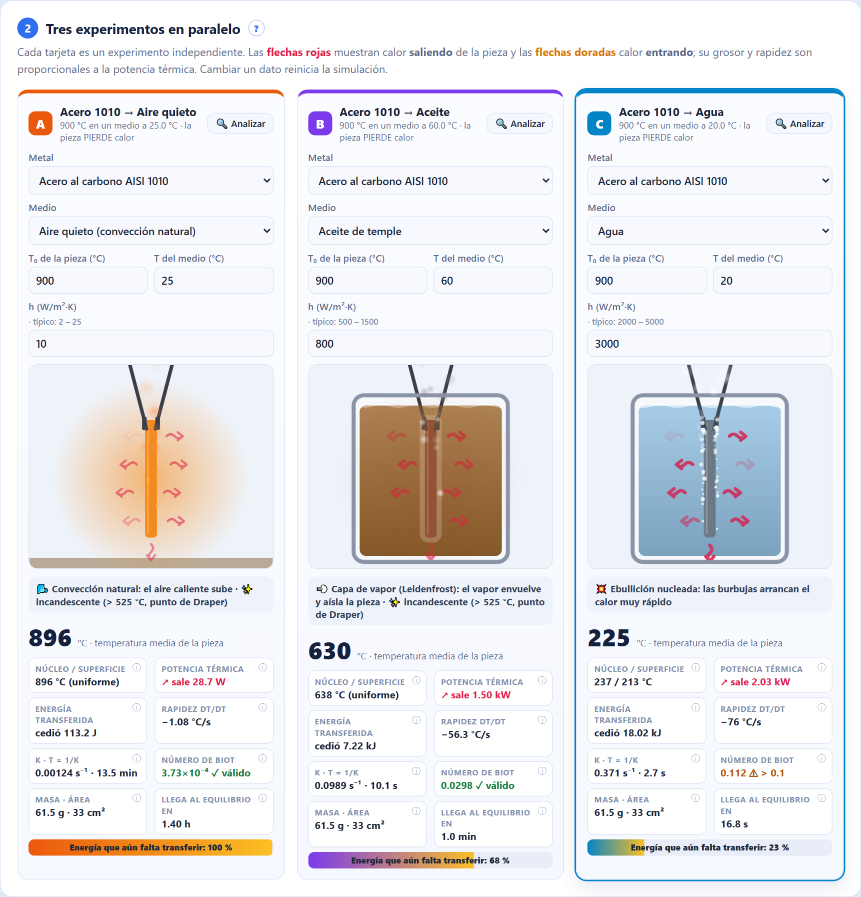

<sub>Acero a 900 °C templado en aire, aceite y agua: color real de incandescencia, capa de vapor, ebullición y flechas de flujo de calor.</sub>

</div>

---

## 📑 Contenido

- [✨ Qué lo hace especial](#-qué-lo-hace-especial)
- [🚀 Inicio rápido](#-inicio-rápido)
- [🖼️ Galería](#️-galería)
- [🧮 El modelo físico](#-el-modelo-físico)
- [🔁 Del dato a la gráfica](#-del-dato-a-la-gráfica)
- [🧪 Escenarios incluidos](#-escenarios-incluidos)
- [📊 Datos científicos](#-datos-científicos)
- [📘 Ayuda e instructivo](#-ayuda-e-instructivo)
- [⚠️ Límites del modelo](#️-límites-del-modelo)
- [🗂️ Estructura del proyecto](#️-estructura-del-proyecto)
- [📚 Referencias](#-referencias)

---

## ✨ Qué lo hace especial

<table>
<tr>
<td width="50%" valign="top">

### 🔬 Física real, no números inventados
La constante **k** se calcula con propiedades de tabla del metal, el coeficiente de convección del medio y la geometría de la pieza: $k = \dfrac{hA}{\rho c V}$. El tiempo que se muestra es **tiempo real**.

</td>
<td width="50%" valign="top">

### 🎨 Todo se ve
Color de **incandescencia** real (punto de Draper, 525 °C), **capa de vapor** (Leidenfrost), **ebullición nucleada**, humo, niebla de nitrógeno, escarcha y horno de ladrillo. <b>Flechas rojas</b>: calor que sale. <b>Flechas doradas</b>: calor que entra.

</td>
</tr>
<tr>
<td valign="top">

### 🧮 Matemática paso a paso
Diez pasos con los números del momento: balance de energía, separación de variables, **integral definida**, despeje, **derivadas**, integral de la energía, tiempo objetivo y **número de Biot**. Todo en vivo.

</td>
<td valign="top">

### 📈 La integral se ve
En la gráfica de potencia, el **área sombreada** es la energía transferida, $Q=\int q\,dt$, y crece mientras corre la simulación.

</td>
</tr>
<tr>
<td valign="top">

### 📋 Análisis tipo informe
Calcula **k experimental** con 3 métodos (promedio de razones, logaritmo por intervalo y regresión lineal con R²), explica el sesgo de las diferencias finitas e incluye un **modo laboratorio** con ruido de sensor.

</td>
<td valign="top">

### 🛡️ Validación física
No deja simular aluminio a 900 °C (se funde a 660 °C) ni temperaturas bajo el cero absoluto. Si **Bi ≥ 0.1**, estima el núcleo y la superficie con funciones de **Bessel**.

</td>
</tr>
<tr>
<td valign="top">

### 🌡️ Cámara térmica
Un interruptor pinta toda la escena con la paleta *ironbow* de una cámara infrarroja.

</td>
<td valign="top">

### 🧭 Ayuda integrada
**Recorrido guiado** de 20 pasos, instructivo en ventana, un botón **?** por sección, lecturas con explicación al pasar el mouse y **PDF** descargable.

</td>
</tr>
<tr>
<td valign="top">

### 👆 Clic para entender
Haz clic en cualquier **letra, fórmula, número, columna o fila** de la matemática y del análisis. Aparece qué significa, su valor en el experimento y, para una fila, todos sus cálculos paso a paso.

</td>
<td valign="top">

### 🔬 Ruido de sensor realista
El modo laboratorio simula un termopar tipo K, con ±(0.3 °C + 0.5 % de la lectura). Cada medición muestra en gris la **temperatura real** y separa cuánto es señal y cuánto es ruido.

</td>
</tr>
</table>

---

## 🚀 Inicio rápido

| | En línea | Sin internet |
|---|---|---|
| **1** | Abre **[ley-enfriamiento.vercel.app](https://ley-enfriamiento.vercel.app)** | Descarga el repositorio (*Code → Download ZIP*) |
| **2** | Pulsa **🧭 Recorrido guiado** | Doble clic en `index.html` |
| **3** | Elige **🔥 Temple clásico** y pulsa **▶ Iniciar** | ¡Listo! No hay que instalar nada |

> [!TIP]
> Pulsa **⏸ Pausar** en cualquier momento: se congelan las animaciones, los números y las fórmulas, para explicar con calma.

---

## 🖼️ Galería

<table>
<tr>
<td width="50%">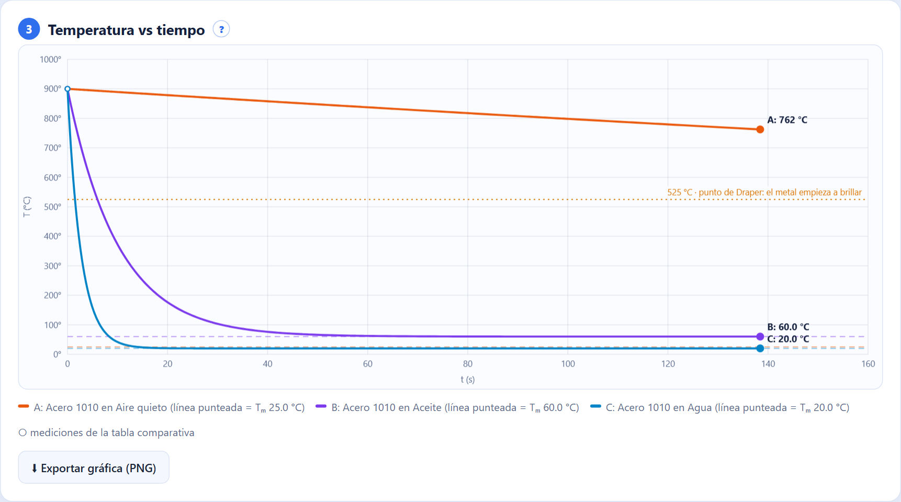<br><sub><b>Temperatura vs tiempo</b>: tres curvas en vivo, asíntotas Tₘ y punto de Draper.</sub></td>
<td width="50%">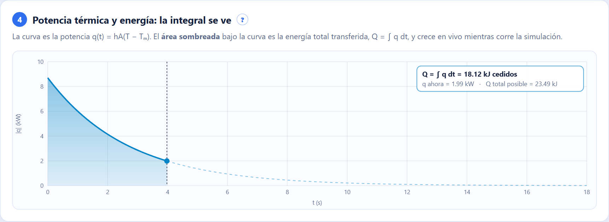<br><sub><b>La integral se ve</b>: el área bajo q(t) es la energía cedida.</sub></td>
</tr>
<tr>
<td>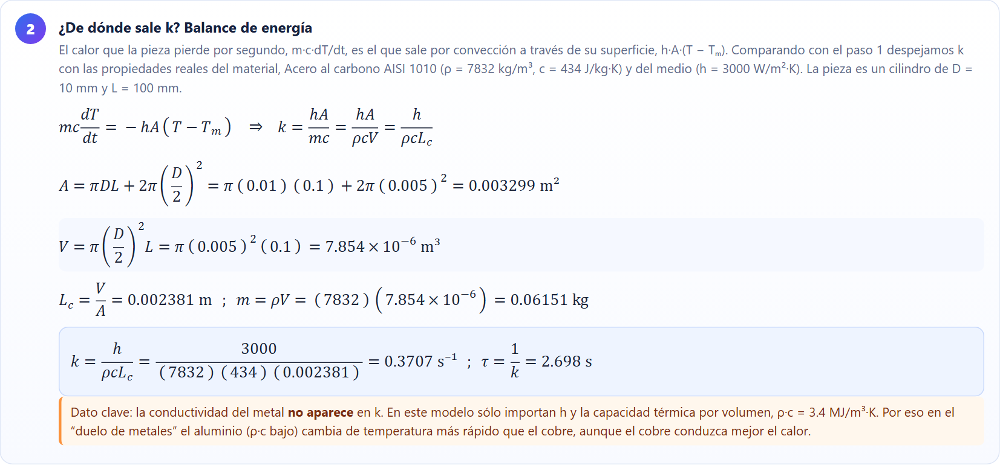<br><sub><b>Matemática paso a paso</b>: k calculada con las propiedades reales.</sub></td>
<td>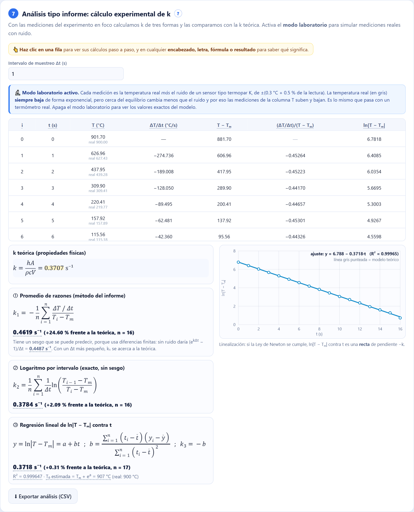<br><sub><b>Análisis tipo informe</b>: 3 métodos para calcular k y la recta de linealización.</sub></td>
</tr>
<tr>
<td>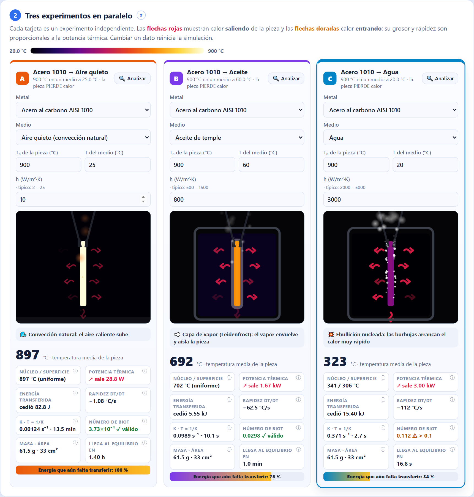<br><sub><b>Vista de cámara térmica</b> (paleta ironbow).</sub></td>
<td>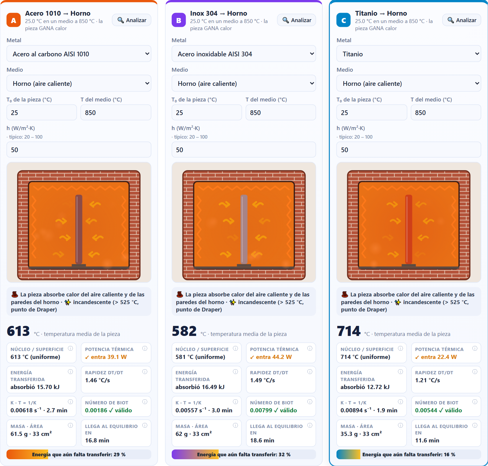<br><sub><b>Ganar calor</b>: las flechas doradas entran a la pieza.</sub></td>
</tr>
<tr>
<td>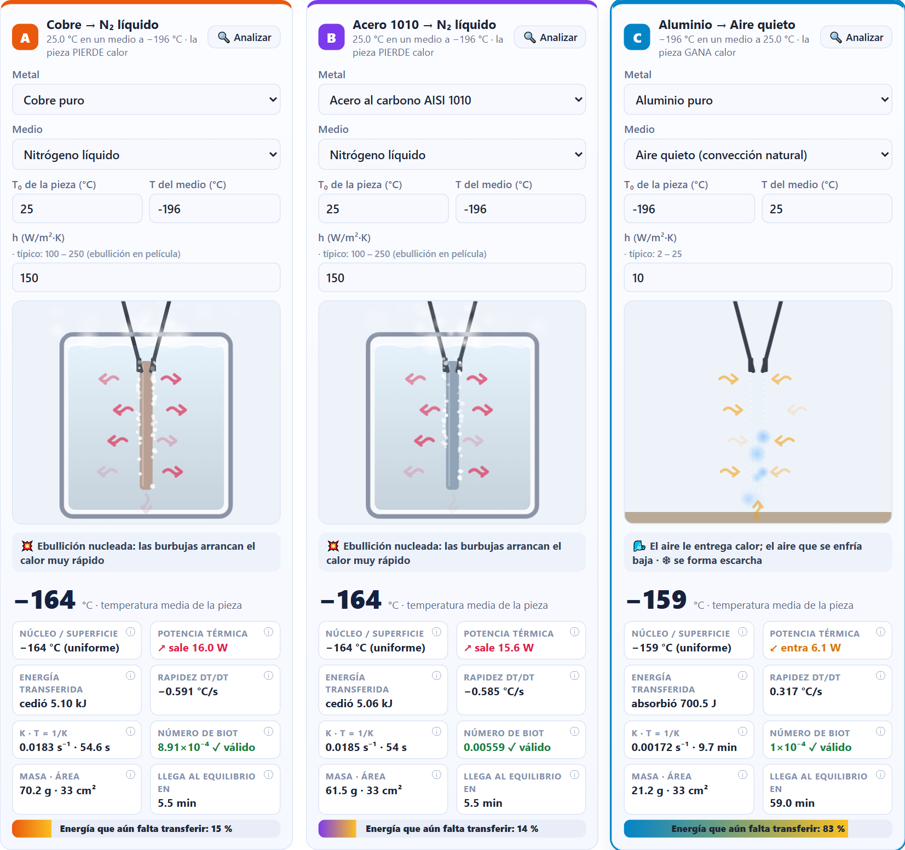<br><sub><b>Criogenia</b>: nitrógeno líquido a −196 °C.</sub></td>
<td><br><sub><b>Recorrido guiado</b> integrado para aprender a usarlo.</sub></td>
</tr>
<tr>
<td>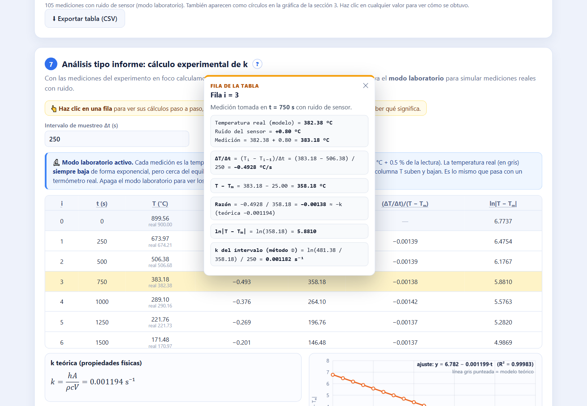<br><sub><b>Clic en una fila</b>: sus cálculos paso a paso.</sub></td>
<td>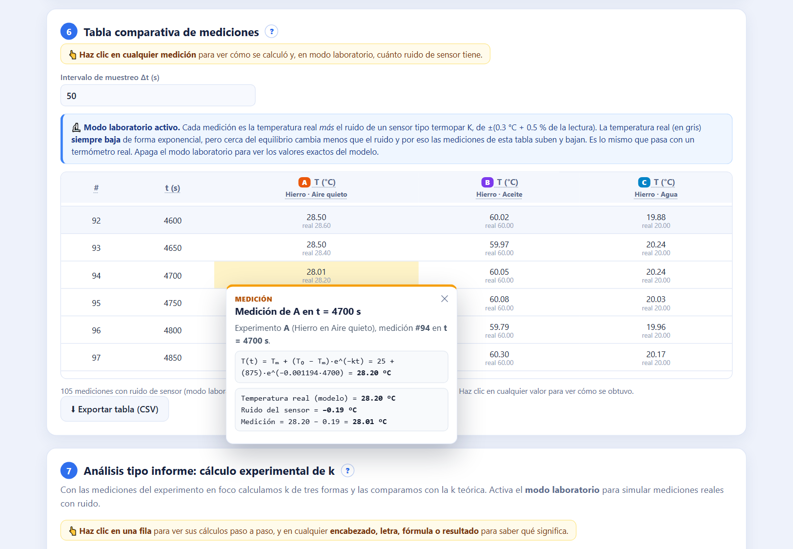<br><sub><b>Clic en una medición</b>: temperatura real + ruido del sensor.</sub></td>
</tr>
</table>

---

## 🧮 El modelo físico

**1. Balance de energía** de la pieza (modelo de capacidad concentrada):

$$
m\,c\,\frac{dT}{dt} = -\,h\,A\,(T - T_m)
\quad\Longrightarrow\quad
\frac{dT}{dt} = -k\,(T - T_m),
\qquad
k = \frac{hA}{\rho\,c\,V} = \frac{h}{\rho\,c\,L_c}
$$

**2. Separación de variables e integración:**

$$
\int_{T_0}^{T}\frac{dT'}{T'-T_m} = -k\int_0^{t}dt'
\quad\Longrightarrow\quad
\ln\left|\frac{T-T_m}{T_0-T_m}\right| = -k\,t
$$

**3. Solución:**

$$
\boxed{\,T(t) = T_m + (T_0 - T_m)\,e^{-k t}\,}
$$

**4. Energía transferida** (el área de la gráfica de potencia):

$$
Q(t) = \int_0^{t} hA\,(T - T_m)\,dt' = m\,c\,(T_0 - T_m)\left(1 - e^{-k t}\right)
$$

**5. Validez:** el modelo es confiable si el número de Biot cumple

$$
Bi = \frac{h\,L_c}{k_{\text{metal}}} < 0.1
$$

> [!NOTE]
> La conductividad del metal **no aparece** en *k*: en este modelo solo importan *h*, la geometría y ρ·c. Por eso, en agua, el aluminio (ρ·c bajo) cambia de temperatura más rápido que el cobre, aunque el cobre conduzca mejor.

---

## 🔁 Del dato a la gráfica

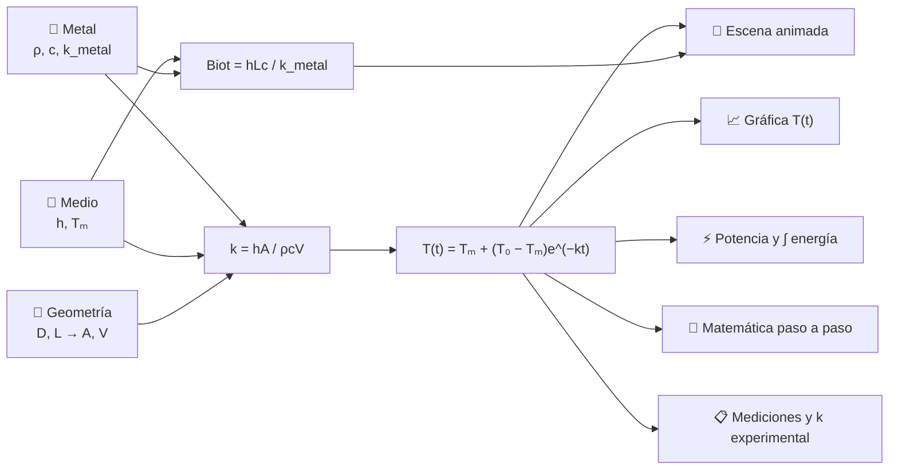

---

## 🧪 Escenarios incluidos

| Escenario | Qué se simula | Qué demuestra |
|---|---|---|
| 🔥 **Temple clásico** | Acero 1010 a 900 °C en aire, aceite y agua | El medio lo cambia todo: segundos contra más de una hora |
| ⚔️ **Duelo de metales** | Cobre, acero y aluminio a 500 °C en agua | Manda ρ·c, no la conductividad |
| 🧪 **Polímero vs agua vs salmuera** | Acero a 850 °C | La salmuera no forma capa de vapor y enfría más rápido |
| ♨️ **Ganar calor** | Piezas a 25 °C en un horno a 850 °C | La misma ley sirve para calentar |
| 🧊 **Criogenia** | Nitrógeno líquido a −196 °C y una pieza helada al aire | Temperaturas bajo cero, película de vapor y escarcha |

Cada experimento acepta además datos **digitados**: metal y medio personalizados, T₀, Tₘ, h, diámetro y largo.

---

## 📊 Datos científicos

<details>
<summary><b>🧱 11 metales</b> (Incropera, Tabla A.1, 300 K)</summary>

| Metal | ρ (kg/m³) | c (J/kg·K) | k (W/m·K) | T fusión (°C) |
|---|---:|---:|---:|---:|
| Acero al carbono AISI 1010 | 7832 | 434 | 63.9 | 1500 |
| Acero inoxidable AISI 304 | 7900 | 477 | 14.9 | 1400 |
| Hierro puro | 7870 | 447 | 80.2 | 1538 |
| Cobre puro | 8933 | 385 | 401 | 1085 |
| Aluminio puro | 2702 | 903 | 237 | 660 |
| Latón 70Cu–30Zn | 8530 | 380 | 110 | 915 |
| Titanio | 4500 | 522 | 21.9 | 1668 |
| Níquel puro | 8900 | 444 | 90.7 | 1455 |
| Plata pura | 10500 | 235 | 429 | 962 |
| Oro puro | 19300 | 129 | 317 | 1064 |
| Tungsteno | 19300 | 132 | 174 | 3422 |

</details>

<details>
<summary><b>🌊 10 medios</b> (Incropera, Tabla 1.1 · ASM Handbook Vol. 4)</summary>

| Medio | h típico (W/m²·K) | Rango | T del medio |
|---|---:|---|---:|
| Aire quieto | 10 | 2 – 25 | 25 °C |
| Aire forzado | 100 | 25 – 250 | 25 °C |
| Aceite de temple | 800 | 500 – 1500 | 60 °C |
| Polímero PAG | 1800 | 1000 – 3500 | 40 °C |
| Agua | 3000 | 2000 – 5000 | 20 °C |
| Salmuera (NaCl 10 %) | 6000 | 4000 – 10000 | 20 °C |
| Sales fundidas | 1200 | 800 – 2000 | 300 °C |
| Nitrógeno líquido | 150 | 100 – 250 | −196 °C |
| Horno (aire caliente) | 50 | 20 – 100 | 850 °C |
| Personalizado | libre | — | libre |

</details>

---

## 📘 Ayuda e instructivo

| Recurso | Dónde |
|---|---|
| 🧭 **Recorrido guiado** (20 pasos) | Botón en el encabezado de la página |
| 📘 **Instructivo completo** | Botón **?** flotante o **📘 Instructivo de uso** · [`docs/instructivo.html`](docs/instructivo.html) |
| ⬇️ **Instructivo en PDF** (32 páginas) | [`docs/Instructivo_Quiz_Enfriamiento.pdf`](docs/Instructivo_Quiz_Enfriamiento.pdf) |
| ❓ **Ayuda por sección** | Botón **?** junto al título de cada sección |
| ⓘ **Explicación de cada lectura** | Pasa el mouse sobre cualquier dato de una tarjeta |

El instructivo incluye un **guion de 7 minutos para presentar al profesor**, experimentos para explorar con su respuesta esperada, un glosario y preguntas frecuentes.

---

## ⚠️ Límites del modelo

> [!IMPORTANT]
> Entender dónde deja de valer la ley también es parte de entenderla. El simulador lo explica en su sección 9.

- **Biot:** con Bi ≥ 0.1 el núcleo queda más caliente que la superficie. Se estima con la solución de un término del cilindro.
- **h constante:** un temple real pasa por capa de vapor, ebullición y convección. Se animan las etapas, pero la ecuación usa un h promedio.
- **Radiación:** a 900 °C en aire equivale a unos 100 W/m²·K y no se incluye.
- **Propiedades a 300 K**, **baño infinito** (Tₘ constante) y **sin calor latente** de la transformación austenita → martensita.

---

## 🗂️ Estructura del proyecto

```
📁 Quizz_Ley_Enfriamiento
├── 📄 index.html          → estructura de la página
├── 🎨 style.css           → estilos y animaciones
├── 🧱 data.js             → tablas de metales, medios y escenarios
├── ⚙️ script.js           → física, escenas, gráficas, matemática y análisis
├── 🧭 guide.js            → recorrido guiado, instructivo en ventana y bienvenida
├── 📁 docs
│   ├── 📘 instructivo.html
│   ├── 📕 Instructivo_Quiz_Enfriamiento.pdf
│   └── 🖼️ img/            → capturas del simulador
└── 📝 README.md
```

---

## 📚 Referencias

1. Incropera, F. P., DeWitt, D. P., Bergman, T. L. & Lavine, A. S. *Fundamentals of Heat and Mass Transfer*. Wiley. Tablas 1.1 y A.1; capítulo 5 (sistemas de capacidad concentrada y solución de un término).
2. ASM International. *ASM Handbook, Vol. 4: Heat Treating* (medios de temple).
3. Newton, I. (1701). *Scala graduum caloris*. Philosophical Transactions of the Royal Society.

---

<div align="center">

**Quiz de Enfriamiento** · Hecho con 🔥 por **Alejandro Piedrahita**, **Daniel Colorado** y **Sebastián Patiño**

[▶ Abrir el simulador](https://ley-enfriamiento.vercel.app) · [📘 Instructivo PDF](docs/Instructivo_Quiz_Enfriamiento.pdf)

</div>
